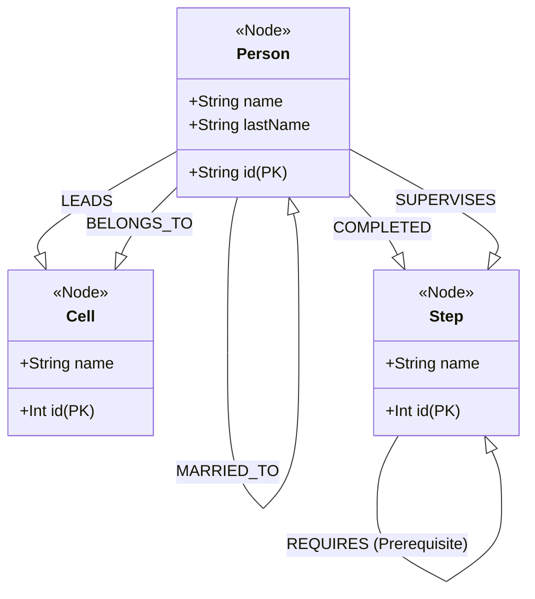

# Graph Schema Definition: Nodes & Edges

This document defines the "Schema-less" structure of our Graph Nodes and the Edges that connect them. Think of this as the **Graph UML** for JMMinistry.

## Node Definitions

### 1. Person Node (`:Person`)
Maps to the `PersonalInfo` relational table. Represents any user, leader, or disciple in the ministry.
- **Properties:**
  - `id`: string (UUID from Identity)
  - `name`: string
  - `lastName`: string

### 2. Cell Node (`:Cell`)
Maps to the `Cells` relational table. Represents a small group or cell meeting.
- **Properties:**
  - `id`: int
  - `name`: string

### 3. Step Node (`:Step`)
Maps to the `DiscipleSteps` relational table. Represents a course, lesson, or milestone in the Disciple Journey.
- **Properties:**
  - `id`: int
  - `name`: string

---

## Relationship Definitions (Edges)

| Edge Type | From | To | Description |
| :--- | :--- | :--- | :--- |
| `[:LEADS]` | `:Person` | `:Cell` | A leader who is responsible for a cell. |
| `[:BELONGS_TO]` | `:Person` | `:Cell` | A disciple who is a member of a cell. |
| `[:MARRIED_TO]` | `:Person` | `:Person` | Spouse relationship (Peer-to-Peer). |
| `[:COMPLETED]` | `:Person` | `:Step` | A disciple who has finished a specific step. |
| `[:REQUIRES]` | `:Step` | `:Step` | A prerequisite requirement (DAG). |
| `[:SUPERVISES]` | `:Person` | `:Step` | A leader who approved/supervised a step completion. |

---

## Graph Visual Schema (UML Equivalent)



## Complex Hierarchy Visualization

This diagram shows how the Graph simplifies the "Downline" traversal that is currently expensive in SQL.

```mermaid
graph TD
    %% Pastor/Leader Level
    P1((Person: Pastor John)) --"LEADS"--> C1[Cell: Main Cell]
    
    %% Cell Membership
    C1 --"CONTAINS"--> P2((Person: Leader Mark))
    C1 --"CONTAINS"--> P3((Person: Disciple Sarah))
    
    %% Recursive Leadership (The "Graph Power")
    P2 --"LEADS"--> C2[Cell: North Branch]
    C2 --"CONTAINS"--> P4((Person: New Disciple))
    
    %% Disciple Journey Logic
    P4 --"COMPLETED"--> S1(Step: Foundation)
    S2(Step: Leadership 1) --"REQUIRES"--> S1
    
    %% Path Query Example
    style P1 fill:#f9f,stroke:#333
    style P4 fill:#bbf,stroke:#333
    linkStyle 0,2,4 stroke:red,stroke-width:2px,label: "Downline Path"
```

## Key Constraints
- **Uniqueness:** The `id` property on all nodes must match the Primary Key in the corresponding PostgreSQL table.
- **Directionality:** Edges are directed. For example, `(Person)-[:LEADS]->(Cell)` is valid, but the reverse is not stored (though it can be traversed backwards in Cypher).
- **Properties on Edges:** We may store metadata on edges, such as `since: datetime` on a `BELONGS_TO` edge to track history without extra tables.
