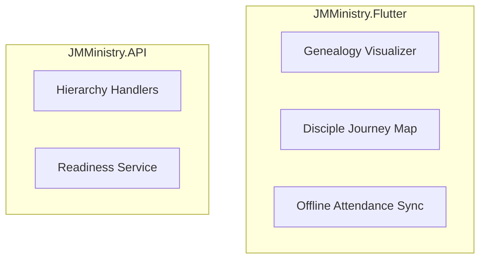

# Master Plan: JMMinistry Graph-Relational Hybrid Transition

This folder contains the step-by-step architectural transition of the JMMinistry project from a traditional relational model to a hybrid **Graph-Relational** system.

## The Problem
The current discipleship and cell hierarchy are built on recursive relational queries (C# loops and SQL CTEs). This is causing:
1. **Performance Bottlenecks:** Recursive permission checks (e.g., `CellCheckIsAuthorized`) trigger multiple database round-trips.
2. **Transfer Complexity:** Moving a disciple or leader between cells requires cascading updates to foreign keys, often losing historical context or creating "orphan" records.
3. **Requirement Logic:** Checking prerequisites for courses (Disciple Journey) is set-based and lacks the flexibility of a Directed Acyclic Graph (DAG).

## The Solution
We will implement **Apache AGE** as an extension for PostgreSQL. This allows us to keep our reliable relational data (Identity, Attendance, Notes) while using **Cypher (Graph Query Language)** for the "Wiring" (Genealogy, Prerequisites, Permissions).

## The Strategy
We will use a **Hybrid ORM** approach:
- **EF Core:** Remains the Source of Truth for CRUD operations on Profile, Attendance, and Identity.
- **Dapper:** Used as a high-performance "Graph Client" to execute Cypher queries on the same PostgreSQL connection.

## Roadmap Summary
- [**Phase 0: Dapper Infrastructure**](./Phase0_Dapper_Infrastructure.md): Preparing the app to handle two ORMs on a shared connection.
- [**Phase 1: Apache AGE Setup**](./Phase1_Apache_AGE_Setup.md): Enabling the Graph engine in the database and Docker.
- [**Phase 2: Sync and Mirroring**](./Phase2_Sync_and_Mirroring.md): Projecting relational data into the Graph using Interceptors.
- [**Phase 3: Hierarchy and Permissions**](./Phase3_Hierarchy_and_Permissions.md): Replacing recursive logic with Cypher paths.
- [**Phase 4: Disciple Journey & Transfers**](./Phase4_Disciple_Journey_DAG.md): Handling the "Fluid Transfer" and Course DAG.
- [**Phase 5: Flutter Mobile & Visualizations**](./Phase5_Frontend_and_Visualizations.md): Building the mobile experience for genealogy trees.

## Architectural Mermaid Diagram


    subgraph Infrastructure [JMMinistry.Infrastructure]
        EF[EF Core - Relational CRUD]
        DP[Dapper - Graph Cypher]
    end

    subgraph Database [PostgreSQL + Apache AGE]
        RT[(Relational Tables: Identity, Attendance, Notes)]
        GN[(Graph Nodes: Person, Cell, Step)]
        GE{Graph Edges: LEADS, BELONGS_TO, REQUIRES}
    end

    V --> H
    D --> R
    H --> DP
    R --> DP
    EF --> RT
    DP --> GN
    DP --> GE
```
