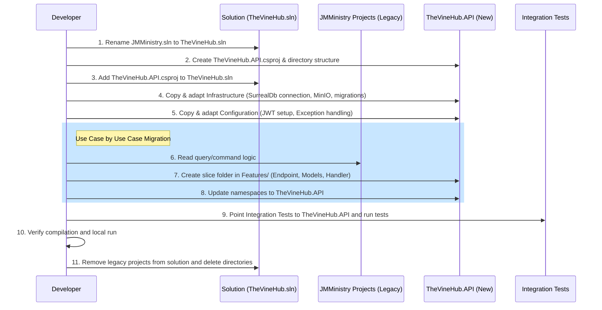

# Refactoring Plan: Transitioning to Vertical Slices & TheVineHub Migration

This document outlines the step-by-step parallel migration plan to consolidate the backend architecture and transition to **TheVineHub**, a generic, multi-tenant church ministry solution.

---

## 1. Project Naming & Metaphor

*   **Project Name**: **TheVineHub**
*   **The Metaphor**: The church database is the central vine (John 15), and members build their own collaborative ministries (cells, music ministries, outreach groups) as branches connected to it.
*   **Namespaces**: 
    *   `TheVineHub.API` (The unified API assembly)
    *   `TheVineHub.API.Features` (Vertical slices)
    *   `TheVineHub.API.Infrastructure` (Database, storage, and migrations)
    *   `TheVineHub.API.Configuration` (App settings and security filters)

---

## 2. Parallel Migration Strategy

To avoid destructive renaming and ensure zero downtime/build breakages during refactoring, we will rename the solution file first and create the new project **TheVineHub.API** in parallel alongside the existing `JMMinistry` projects under the newly named solution **TheVineHub.sln**.

```text
backend/
├── TheVineHub.sln                    <-- Renamed from JMMinistry.sln
├── JMMinistry.API/                   <-- Legacy (Keep untouched during migration)
├── JMMinistry.Application/           <-- Legacy
├── JMMinistry.Infrastructure.Persistence/ <-- Legacy
│
├── TheVineHub.API/                   <-- NEW Consolidated Project
│   ├── Configuration/
│   ├── Infrastructure/
│   └── Features/
```

Once all endpoints, database logic, and tests are migrated to `TheVineHub.API` and verified, we will delete the legacy `JMMinistry.*` folders and clean up the solution references.

---

## 3. Step-by-Step Initial Setup

### Step 1: Rename the Solution File
Rename the root solution file from `JMMinistry.sln` to `TheVineHub.sln`.

### Step 2: Create the New Project (`TheVineHub.API.csproj`)
Create the new project directory `backend/TheVineHub.API` and add `TheVineHub.API.csproj`:

```xml
<Project Sdk="Microsoft.NET.Sdk.Web">

  <PropertyGroup>
    <TargetFramework>net10.0</TargetFramework>
    <Nullable>enable</Nullable>
    <ImplicitUsings>enable</ImplicitUsings>
    <RootNamespace>TheVineHub.API</RootNamespace>
  </PropertyGroup>

  <ItemGroup>
    <!-- Consolidated dependencies -->
    <PackageReference Include="dotenv.net" Version="3.2.0" />
    <PackageReference Include="FluentValidation.DependencyInjectionExtensions" Version="11.11.0" />
    <PackageReference Include="Mediator.SourceGenerator" Version="2.1.7" />
    <PackageReference Include="Microsoft.AspNetCore.Authentication.JwtBearer" Version="10.0.7" />
    <PackageReference Include="Microsoft.AspNetCore.OpenApi" Version="10.0.7" />
    <PackageReference Include="Minio" Version="7.0.0" />
    <PackageReference Include="Scalar.AspNetCore" Version="2.0.0" />
    <PackageReference Include="SurrealDb.Net" Version="0.10.2" />
    <PackageReference Include="System.IdentityModel.Tokens.Jwt" Version="8.17.0" />
  </ItemGroup>

  <ItemGroup>
    <!-- Embed SurrealQL migration scripts directly -->
    <EmbeddedResource Include="Infrastructure/Database/Migrations/*.surql" />
  </ItemGroup>

</Project>
```

### Step 3: Add the New Project to the Renamed Solution
Run the command to reference the new project in the renamed solution:
```bash
dotnet sln TheVineHub.sln add TheVineHub.API/TheVineHub.API.csproj
```

---

## 4. Target Directory Layout inside `TheVineHub.API`

```text
TheVineHub.API/
├── Configuration/                 <-- App setup, DI registration, JWT, and filters
│   ├── JWTSettings.cs
│   ├── OpenTelemetryConfiguration.cs
│   └── DependencyInjection.cs     
│
├── Infrastructure/                <-- Storage, database connectivity, and migrations
│   ├── Database/
│   │   ├── Migrations/            <-- Embedded .surql files
│   │   └── DbMigrationService.cs
│   └── Storage/
│       └── MinioPhotoService.cs
│
├── Features/                      <-- Use cases grouped in folders by slice
│   ├── Cells/
│   │   ├── UpsertCell/
│   │   │   ├── UpsertCellEndpoint.cs
│   │   │   ├── UpsertCellModels.cs   <-- Request, Command, DTO & Validator
│   │   │   └── UpsertCellHandler.cs
│   │   └── AddDisciples/
│   │       ├── AddDisciplesEndpoint.cs
│   │       ├── AddDisciplesModels.cs
│   │       └── AddDisciplesHandler.cs
│   └── Meetings/
│       └── CreateMeeting/
│           ├── CreateMeetingEndpoint.cs
│           ├── CreateMeetingModels.cs
│           └── CreateMeetingHandler.cs
```

---

## 5. Key Refactoring & Quality Implementations

### A. Minimal API Routing & Discovery
Define the interface and extension to automatically scan and register all vertical slice endpoints in `Program.cs`.

1.  **Define `IEndpoint.cs`**:
    ```csharp
    namespace TheVineHub.API.Features;

    public interface IEndpoint
    {
        void MapEndpoint(IEndpointRouteBuilder app);
    }
    ```

2.  **Add `EndpointExtensions.cs`**:
    ```csharp
    using System.Reflection;

    public static class EndpointExtensions
    {
        public static void MapEndpoints(this IEndpointRouteBuilder app)
        {
            var endpointTypes = Assembly.GetExecutingAssembly().GetTypes()
                .Where(t => t.IsClass && !t.IsAbstract && typeof(IEndpoint).IsAssignableFrom(t));

            foreach (var type in endpointTypes)
            {
                var instance = (IEndpoint)Activator.CreateInstance(type)!;
                instance.MapEndpoint(app);
            }
        }
    }
    ```

---

### B. Lightweight Response Wrapping (No Stream Interception)
Implement a global **Endpoint Filter** that wraps response objects in the unified `Response<T>` envelope before serialization.

1.  **Define `WrapResponseFilter.cs`**:
    ```csharp
    using TheVineHub.API.Common;

    public class WrapResponseFilter : IEndpointFilter
    {
        public async ValueTask<object?> InvokeAsync(EndpointFilterInvocationContext context, EndpointFilterDelegate next)
        {
            var result = await next(context);

            if (result is not Response<object>)
            {
                return new Response<object>
                {
                    Data = result,
                    Success = true,
                    StatusCode = StatusCodes.Status200OK,
                    Details = $"Operation success: {context.HttpContext.Request.Path}"
                };
            }

            return result;
        }
    }
    ```

2.  **Apply the filter in `Program.cs`**:
    ```csharp
    var apiGroup = app.MapGroup("/api").AddEndpointFilter<WrapResponseFilter>();
    apiGroup.MapEndpoints();
    ```

---

### C. Fixing the Exception Handler Bug
Ensure fallback/unhandled errors return a valid `HTTP 500` status:

```csharp
else
{
    response.StatusCode = StatusCodes.Status500InternalServerError;
    response.Details = "An unexpected server error occurred.";
    response.Errors = [exception.Message];
}
```

---

## 6. Migration Execution Workflow


